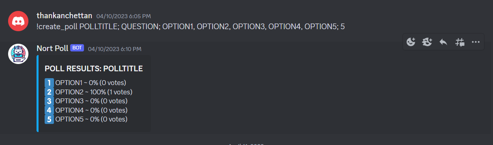

# Nort Poll - Discord Poll Conductor Bot


Nort Poll is a dynamic Discord bot specially crafted to conduct engaging polls within your Discord servers. With Nort Poll, you can create captivating polls effortlessly, complete with a title, a thought-provoking question, customizable options, and a convenient time limit for voting. Excite your community with lively discussions and make data-driven decisions with the help of Nort Poll!



## Features

- **Seamless Poll Creation:** Utilize Nort Poll's intuitive command `!create_poll` to initiate a poll with ease, specifying the title, question, multiple options, and the desired time limit.

- **Interactive Polling Experience:** Encourage active participation among your Discord members with Nort Poll's user-friendly interface and straightforward voting process.

- **Real-Time Results:** Monitor the poll progress and receive real-time updates on the voting outcomes to gain valuable insights.

- **Time-Limited Polls:** Set a specific time duration for each poll to ensure timely feedback and avoid prolonged voting periods.

- **Flexible Option Choices:** Design polls with multiple options, accommodating various preferences and inquiries.

## Commands

To conduct a poll using Nort Poll, use the following command:

```
!create_poll POLLTITLE; QUESTION; OPTION1, OPTION2, OPTION3, OPTION4, OPTION5; TIME (in minutes)
```

- **POLLTITLE:** Specify the title of your poll for identification purposes.

- **QUESTION:** Frame a compelling question that you want your community to answer.

- **OPTION1, OPTION2, OPTION3, OPTION4, OPTION5:** List the different options for your poll, separated by commas.

- **TIME (in minutes):** Set the time duration in minutes for your poll's voting period.

## Getting Started

To add Nort Poll to your Discord server, follow these simple steps:

1. Invite Nort Poll to your server using the provided invite link.

2. Ensure that Nort Poll has appropriate permissions to manage messages and create polls in your preferred channels.

3. Create engaging polls using the `!create_poll` command, adhering to the specified format.

4. Watch as your community actively participates in the polls and observe the results in real-time.

5. Delight in lively discussions and data-driven decision-making facilitated by Nort Poll!

## Note

Nort Poll is an independent project and is not affiliated with Discord. It is intended for recreational purposes only. Please use Nort Poll responsibly and abide by Discord's terms of service.

---
*Disclaimer: Nort Poll is intended for interactive and engaging community interactions and should not be used for any malicious activities. Ensure responsible usage and adhere to Discord's guidelines while interacting with the bot.*
